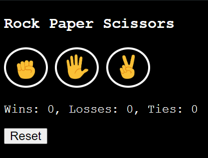
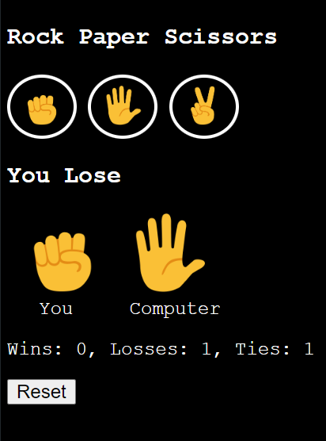
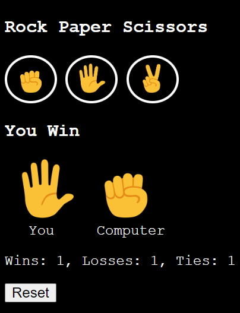

# Rock-Paper-Scissors Game

A simple and interactive Rock-Paper-Scissors game built with HTML, CSS, and JavaScript. This game allows users to play against the computer and see the result of their choices in real-time.

## Features
- Play against the computer
- Interactive user interface
- Responsive design
- Simple game logic with visual feedback

## Live Demo
You can check out the live version of the calculator here: [Rock-Paper-Scissors Game](https://ajitkumarroy.github.io/rock-paper-scissors/)






## Installation
1. **Clone the repository:**
   ````bash
   git clone https://github.com/AjitKumarRoy/rock-paper-scissors.git
2. **Navigate to the project directory:**
   ````bash
   cd rock-paper-scissors
3. **Simply open index.html using your preferred web browser to start playing the game.**


## Usage
1. Click on one of the options: Rock, Paper, or Scissors.
2. The computer will make its choice, and the result will be displayed.
3. Play as many rounds as you like!

## Technologies Used
- **HTML**: Structure of the game
- **CSS**: Styling and layout
- **JavaScript**: Game logic and interactivity

## Contributing
Feel free to fork the repository and make improvements or bug fixes. If you have any suggestions or issues, please open an issue on GitHub or submit a pull request.

## License
This project is licensed under the MIT License - see the [LICENSE](./LICENSE) file for details.

